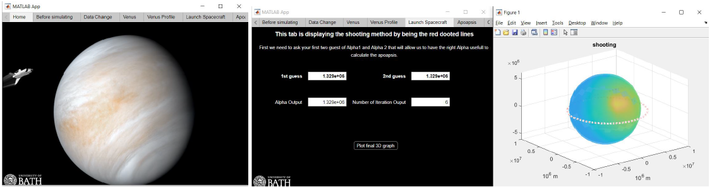

# Modelling-Techniques-Numerical-Modelling-of-Aerocapture-for-a-Scienti-c-Mission-to-Venus

This report covers the modelling of the aerocapture method of space travel on MATLAB. The position at which a spacecraft would have to enter Venus' atmosphere in order to loop around the planet was determined by running a series of functions which solved the underlying boundary value problem through a shooting method. The task was taken further, attempting to put the spacecraft in orbit. Furthermore, a GUI application was generated for optimised user experience.

<!-- add image -->

